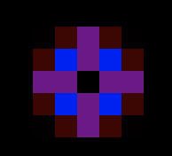

# Lenia-Java

This project implements a cellular automaton called Lenia. \
Lenia is a generalization of Conway's Game of Life, with continuous states, space and time. 

## Definition 

A cellular automaton is defined as a quadruple $(\mathcal{L}, \mathcal{S}, \mathcal{N}, f)$, where:

- $\mathcal{L} \subseteq \mathbb{Z}^d$ is the $d$-dimensional lattice or cellular space (for Lenia, typically $d=2$).
- $\mathcal{S}$ is a finite set of states; in classical cellular automata, states are discrete (e.g., alive or dead), but in Lenia, the state is continuous, typically represented as a real number in $[0,1]$.
- $\mathcal{N} \subseteq \mathcal{L}$ is the neighborhood, a finite set of relative positions around each cell.
- $f : \mathcal{S}^{|\mathcal{N}|} \to \mathcal{S}$ is the local update rule, determining the next state of a cell based on the states of its neighbors.

## Lenia Overview

Lenia extends classical cellular automata by introducing:

- **Continuous states:** Each cell's state is a continuous value representing "mass" or "energy," allowing smooth gradients rather than binary on/off states.
- **Kernel convolution:** The neighborhood influence is calculated using a continuous kernel function, typically a radially symmetric function, which weights neighbors' contributions smoothly.

The images below represent the influence of the neighborhood for the cell placed in the center of the grid.

- **Growth mapping:** After convolution, a nonlinear growth function modulates the update, shaping the dynamics and enabling complex patterns.

## Mathematical Formulation

1. **State space:** Each cell at position $\mathbf{x} \in \mathcal{L}$ has a state $A(\mathbf{x}, t) \in [0,1]$ at time $t$.

2. **Kernel convolution:** Define a kernel $K: \mathbb{R}^d \to \mathbb{R}$ representing neighborhood influence. The potential $U(\mathbf{x}, t)$ at cell $\mathbf{x}$ is computed as:

$$
U(\mathbf{x}, t) = (K * A)(\mathbf{x}, t) = \sum_{\mathbf{y} \in \mathcal{N}} K(\mathbf{y}) A(\mathbf{x} + \mathbf{y}, t)
$$

where $*$ denotes convolution.

3. **Growth function:** A nonlinear function $G: \mathbb{R} \to \mathbb{R}$ maps the potential to a growth value:

$$
G(U) = 2 \exp\left(- \frac{(U - \mu)^2}{2 \sigma^2}\right) - 1
$$

where $\mu$ and $\sigma$ control the center and width of the growth peak.

4. **Update rule:** The state evolves continuously with time step $\Delta t$ as:

$$
A(\mathbf{x}, t + \Delta t) = \text{clip}\left( A(\mathbf{x}, t) + \Delta t \cdot G(U(\mathbf{x}, t)), 0, 1 \right)
$$

where $\text{clip}$ confines values to $[0,1]$.

## Example of Lenia Simulation

The image below illustrates an evolving Lenia pattern, showing smooth, organic shapes that move and interact like simple lifeforms:

